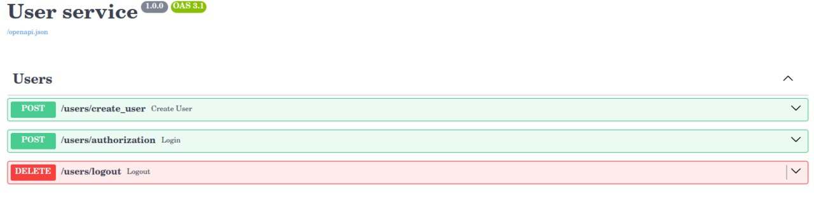

# FastAPI-Authentication

A non-commercial FastAPI project for user registration, authentication and authorization.
### Installation and Running

These instructions will help you run the project.



## Requirements

Ensure you have the following software installed:

- [Docker](https://www.docker.com/get-started)
- [Docker Compose](https://docs.docker.com/compose/install/)
- [GNU Make](https://www.gnu.org/software/make/)

___
## Installation

1. **Clone the repository:**
   ```bash
   git clone https://github.com/podrivnick/FastAPI-Authentication.git
   cd FastAPI-Authentication
   ```

2. Install all required packages in `Requirements` section.
3. Set up environment variables:
   - Create a `.env` file and fill it according to `.env.example`.

### Implemented Commands

* `make app` - up application and database/infrastructure
* `make app-logs` - follow the logs in app container
* `make migrate` - apply all made migrations
* `make app-down` - down application and all infrastructure

### Specific Commands

* `make appbash` - enter into application container bash
* `make dbbash` - enter into postgres container bash
* `make runtest` - run all tests

___
## Structure

```plaintext
FastAPI-Authentication/
```

## Technology
+ **FastAPI**
+ **Python**
+ **Docker**
+ **Redis**
+ **Postgres**

___
## Design Patterns
+ **Authentication and Authorization** (Session)
+ **Repository Pattern**
+ **Configuration Management** (dotenv)
+ **Factory Pattern**
+ **Dependency Injection**
+ **Mediator** (Didiator)

## Author
Author of the backend: ***Rybakov Artem***  (https://github.com/podrivnick)
